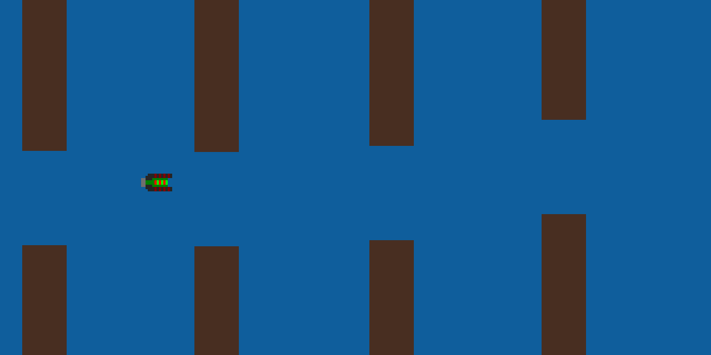

# robo-swimmer
A small Flappy Bird clone where you navigate a submarine past obstacles.

I made this game quickly to learn pygame, so the visuals are quite crude. One day I plan to implement a neural network and a genetic algorithm to the game for it to play itself.



## Running
```bash
pip3 install -r requirements.txt
python3 game.py
```

## Buttons
* `Space` to swim up
* `o` to add a new obstacle manually
* `q` to quit the game

## Acknowledgements / Copyrights
* Player sprite by C. Hackenberg: https://opengameart.org/content/spoof-pixel-ships-jungle-enemies
